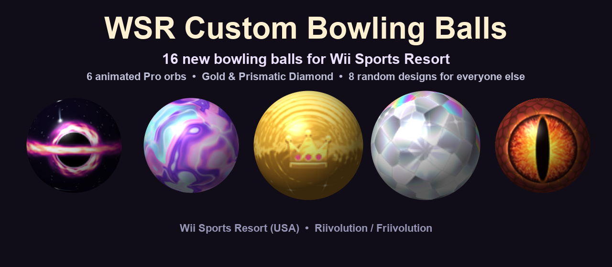
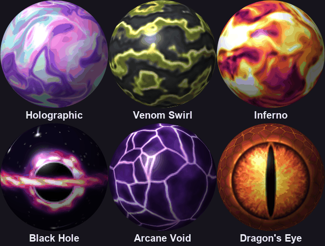
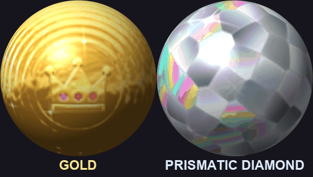
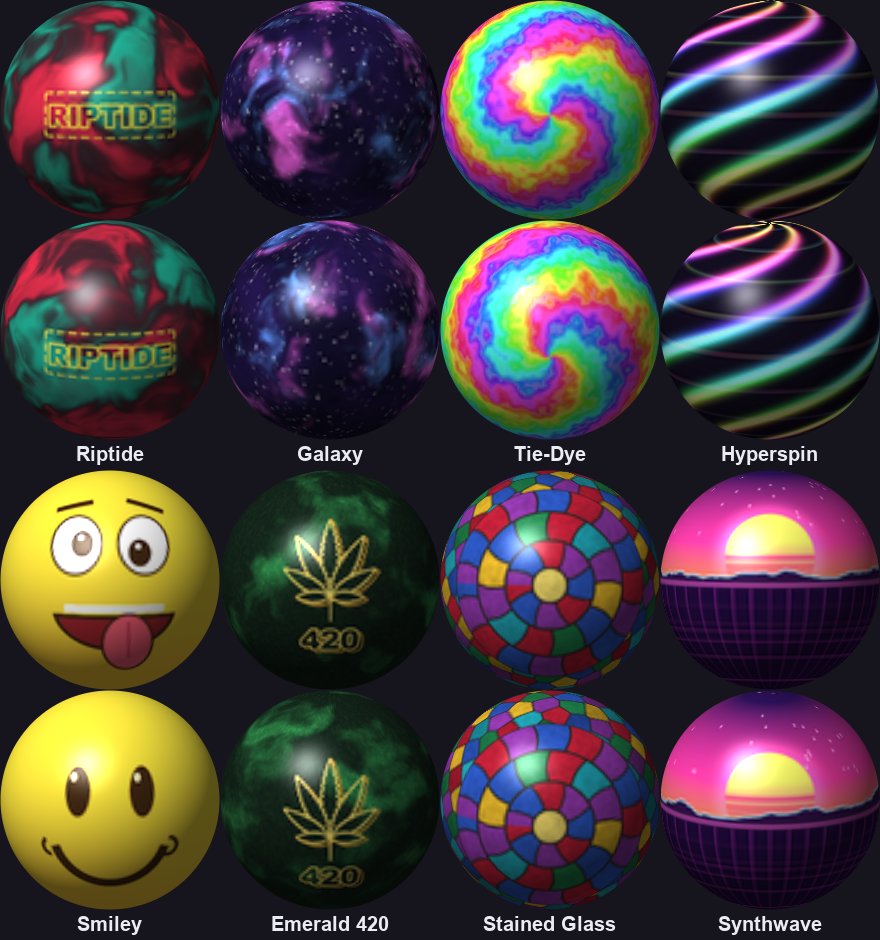

# WSR Custom Bowling Balls

**16 new bowling balls for Wii Sports Resort**, loaded with Riivolution / Friivolution.

- **6 animated Pro orbs** for players at Pro rank (1000+ skill): a different one each game, or pick your favourite
- **2 prestige tiers**: an animated **Gold** ball and the **Prismatic Diamond**
- **8 designs for everyone else**: every non-Pro player gets a random one each time Bowling loads

No save data is touched; turn the option off and the game is completely stock.

## Animated Pro orbs

Holographic · Venom Swirl · Inferno · Black Hole · Arcane Void · Dragon's Eye

## Gold & Prismatic Diamond

Upgrade a Pro player's ball once they've earned it: **Gold at 1500 skill, Prismatic Diamond at 2000**
(you set it in the Riivolution menu, see below).

## Random balls for non-Pro players

Riptide · Galaxy · Tie-Dye · Hyperspin · Smiley · Emerald 420 · Stained Glass · Synthwave

## Requirements

- **Wii Sports Resort, USA version (RZTE01)**. Developed and tested on the USA **Rev 1** disc.
- A Wii with the Homebrew Channel and **Riivolution** (or **Friivolution**)
- An SD card

## Installation

1. Download `WSR_Custom_Bowling_Balls_vX.Y.zip` from [Releases](../../releases).
2. Copy the **`riivolution`** and **`WSR_ball_mod`** folders from the zip to the **root of your SD card**
   (merge with an existing `riivolution` folder if you have one).
3. Start Riivolution / Friivolution and choose Wii Sports Resort.
4. Under **WSR Custom Bowling Balls**, set **Ball mod** (recommended: *Pro: random orb each game*)
   and, if you like, a **Pro ball tier** for your player number.
5. Launch the game and play Bowling.

## Menu options

**Ball mod**

| Choice | What you get |
|---|---|
| **Pro: random orb each game** *(recommended)* | Pro players get a random animated orb each time Bowling loads |
| Pro: Holographic / Venom Swirl / Inferno / Black Hole / Arcane Void / Dragon's Eye | Pro players always get that orb (smoother 16-frame animation) |
| TEST: non-Pro balls get the random orbs | See the animated orbs without being Pro |

With every choice except TEST, non-Pro players get a random design from the regular set.

**P1 / P2 / P3 / P4 Pro ball tier** (Disabled / Gold / Prismatic Diamond)

Upgrades that player number's Pro ball to the **Gold** or **Prismatic Diamond** ball.
The intended rule: unlock Gold at **1500** skill and Diamond at **2000**. It's an honour system, so set it yourself when you get there.
It only affects players who are Pro; everyone else is unchanged.

### Good to know
- **Pro** means 1000+ Bowling skill; that's the game's own rule for who gets a Pro ball.
- **Player number = the order Miis are picked** (P1 is the first Mii). Pick your Mii first to keep your P1 tier.
- The random pick happens each time Bowling loads.

## Troubleshooting

- **The game crashes when Bowling loads:** try one of the single-orb choices (they use a little less memory) and let me know.
- **Balls look normal:** check that *Ball mod* is set (not Disabled) and that your game is the USA version.
  The code patch checks the game's code before applying, so other versions/regions won't change.

## How it works (for the curious)

The textures live in the game's Bowling archive (`Common/BwlScene/common.carc`), which Riivolution swaps for a modified copy.
Animation and random picks come from a small PowerPC patch on `GXLoadTexObj` (the function that hands every texture to the GPU):
when it sees one of the mod's tagged ball textures it points the GPU at the right animation frame / random design for that one draw,
then restores the original, so the game's own data never changes. Gold/Diamond are chosen by a per-player byte that the Riivolution
tier options write. The patch is tested in a PowerPC emulator ([unicorn](https://www.unicorn-engine.org/)) against the game's real code.

See [BUILDING.md](BUILDING.md) to rebuild everything from your own copy of the game.

## Credits

- Made by qwex10, built with Claude (Anthropic)
- Built with [Wiimms ISO / SZS Tools](https://wiimm.de/)
- Loaded by [Riivolution](https://rvlution.net/)

All ball designs are original procedural art made for this mod.

## Disclaimer

Not affiliated with or endorsed by Nintendo. *Wii Sports Resort* is a trademark of Nintendo.
You need your own copy of the game. The release download contains modified copies of the game's Bowling archive
(as is usual for Wii Sports Resort mods); this repository itself contains only the mod's own code and artwork.
